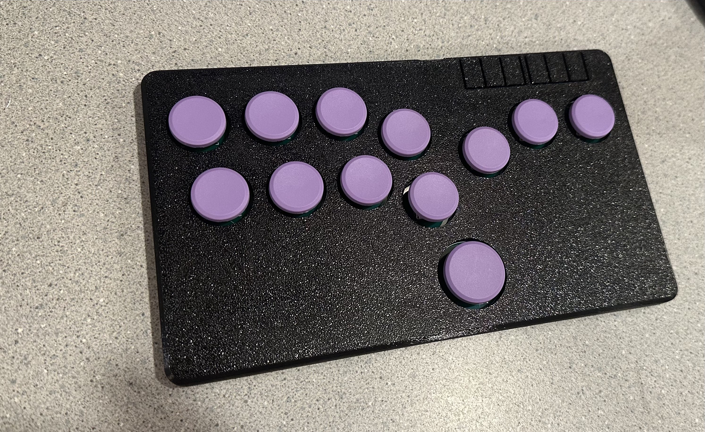

# Flatbox-southpaw: Rev5 Flatbox with mirrored case and rerouted PCB for left handed players!

Controller is finished and 100% confirmed working! 

This repository contains 3D-printable models, PCB design files and code needed to make an arcade controller that looks like this:

The only version that has had the mirroring performed is the [rev5](hardware-rev5)

[rev5](hardware-rev5)
---------------------
case dimensions | 218x126x10mm

compatibility (using provided firmware) | PC, PS3

add-on board | [RP2040-Zero](https://www.waveshare.com/rp2040-zero.htm)

onboard chip | RP2040 

port | USB-C

SMT assembly required | no

firmware | [RP2040](firmware-rp2040)
